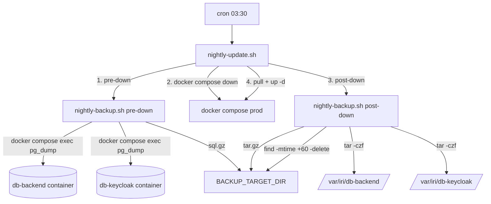

# Requirements

### Overview & Goals
Einfuehrung einer taeglichen, automatisierten Backup-Strategie fuer die persistenten Daten des IRIDIUM Basetool. Die Sicherung laeuft im Rahmen des bestehenden naechtlichen Container-Updates (`scripts/nightly-update.sh`) und nutzt das ohnehin geplante Wartungsfenster, in dem die Container gestoppt sind, um konsistente Sicherungen zu erzeugen.

### Scope

**In Scope**
- Taegliche Sicherung von:
  - `/var/iri/db-backend` (Postgres-Datenverzeichnis Backend-DB) mit tar.gz UND logischem `pg_dump`
  - `/var/iri/db-keycloak` (Postgres-Datenverzeichnis Keycloak-DB) mit tar.gz UND logischem `pg_dump`
- Frei waehlbarer Zielpfad fuer die Backups, konfiguriert ueber eine eigene Datei `scripts/backup.env` (per `source` eingebunden, in `.gitignore`).
- Retention: Sicherungen der letzten **60 Tage** vorhalten, aeltere automatisch entfernen.
- Integration in den bestehenden Update-Ablauf: Aufruf eines neuen Skripts `scripts/nightly-backup.sh` aus `nightly-update.sh` heraus.
- Cron- und logrotate-Konfiguration konsistent zum bestehenden Pattern (`*.cron`, `*.logrotate`).
- Robustes Fehlerverhalten: Backup-Fehler werden geloggt, das Container-Update laeuft weiter, damit das System nicht offline bleibt.

**Out of Scope**
- Sicherung von `/var/iri/redis`, `/var/iri/npm/data`, `/var/iri/npm/letsencrypt`, `/var/iri/keycloak/log`, `/var/iri/backend`, `/var/iri/frontend` (vom Nutzer bewusst ausgeschlossen).
- Off-Site-Replikation (rsync/SSH/S3) - der Zielpfad wird beliebig gewaehlt; ein an dieser Stelle gemounteter Netzwerk-/Backup-Datentraeger ist Sache der Server-Infrastruktur.
- Verschluesselung der Backup-Archive.
- Restore-Automatisierung (es wird nur eine kurze Restore-Anleitung in der README dokumentiert).
- Monitoring/Alerting (ueber Cron-Mail hinaus).

### User Stories
- Als Squadron-Admin moechte ich, dass die Anwendungs- und Keycloak-Datenbank taeglich automatisch gesichert werden, ohne dass ich manuell eingreifen muss.
- Als Admin moechte ich den Zielpfad der Backups frei waehlen koennen (lokale Platte, gemounteter Netzwerk-Share, externer USB-Pfad), ohne das Skript anzufassen.
- Als Admin moechte ich nach einem Datenverlust eine konsistente Sicherung der letzten 60 Tage zur Verfuegung haben, um auf einen beliebigen Tag innerhalb dieses Fensters zurueckrollen zu koennen.
- Als Admin moechte ich, dass alte Sicherungen automatisch entfernt werden, damit das Backup-Ziel nicht volllaeuft.
- Als Admin moechte ich, dass ein fehlgeschlagenes Backup das naechtliche Container-Update nicht blockiert.

### Functional Requirements
- **FR-1**: Das Backup wird einmal taeglich im Rahmen von `nightly-update.sh` ausgefuehrt.
- **FR-2**: Pro Lauf entstehen fuer jede Datenbank zwei Artefakte mit Zeitstempel:
  - `backend-db-volume_<YYYY-MM-DD_HHMMSS>.tar.gz` (Bind-Mount-Archiv)
  - `backend-db-dump_<YYYY-MM-DD_HHMMSS>.sql.gz` (`pg_dump` als logischer Dump)
  - analog `keycloak-db-volume_*.tar.gz` und `keycloak-db-dump_*.sql.gz`.
- **FR-3**: Der Zielpfad ist ueber die Variable `BACKUP_TARGET_DIR` in `scripts/backup.env` konfigurierbar; das Verzeichnis wird bei Bedarf angelegt (`mkdir -p`).
- **FR-4**: Vor dem `docker compose down` werden die `pg_dump`-Dumps aus den laufenden Containern erzeugt (online, konsistent ueber DB-Transaktion).
- **FR-5**: Nach dem `docker compose down` (Container sauber gestoppt) werden die Bind-Mount-Verzeichnisse als tar.gz archiviert (offline, dateisystemkonsistent).
- **FR-6**: Sicherungen, deren Modifikationsdatum aelter als 60 Tage ist, werden im Anschluss aus dem Backup-Zielverzeichnis entfernt (`find -mtime +60 -delete`).
- **FR-7**: Logging in `/var/log/iri-nightly-backup.log` analog zum bestehenden Update-Log; deutschsprachige Meldungen, Zeitstempel pro Phase.
- **FR-8**: Bei Backup-Fehler wird der Fehler geloggt, das aufrufende `nightly-update.sh` bricht aber NICHT ab und fuehrt `pull`/`up` weiter aus.
- **FR-9**: Ein Lockfile (`flock`) verhindert parallele Backup-Laeufe.

### Non-Functional Requirements
- **Konsistenz**: Postgres-Datendateien werden ausschliesslich nach sauberem `docker compose down` archiviert; zusaetzliche `pg_dump`-Dumps bieten versionsunabhaengige Wiederherstellungsoption.
- **Wartbarkeit**: Skript folgt den Konventionen der bestehenden Bash-Skripte (`set -euo pipefail`, `flock`, deutscher Log-Header, identisches Datei-Layout fuer `*.cron` und `*.logrotate`).
- **Sicherheit**: `scripts/backup.env` wird in `.gitignore` aufgenommen; eine `scripts/backup.env.example` als Vorlage wird eingecheckt. Keine Credentials im Skript.
- **Performance**: Backup-Dauer soll das Wartungsfenster nicht relevant verlaengern.

# Technical Design

### Current Implementation

- `scripts/nightly-update.sh` (60 Zeilen): Bash, `set -euo pipefail`, `flock`-Lockfile, `docker compose --profile prod down --timeout 60`, `pull`, `up -d`, anschliessend Health-Check. Wird via Cron um 03:30 ausgefuehrt.
- `scripts/nightly-update.cron` und `scripts/nightly-update.logrotate` als zugehoerige Konfigurationsbausteine.
- `scripts/vpn-restart.sh` als zweites Beispiel fuer das etablierte Skript-Pattern.
- Persistenz im `docker-compose.yml` ausschliesslich ueber Bind-Mounts unter `/var/iri/...` - es gibt keine benannten Docker-Volumes. Relevant fuer Backup:
  - `/var/iri/db-backend` -> Service `db-backend` (Postgres 18, Port 15432, DB `${POSTGRES_DB}`)
  - `/var/iri/db-keycloak` -> Service `db-keycloak` (Postgres 18, Port 15433, DB `${KC_POSTGRES_DB}`)
- DB-Credentials liegen ausschliesslich als Env-Variablen im Compose-File und werden aus der `.env` (root) gezogen.

### Key Decisions

1. **Zwei-Phasen-Backup (online pg_dump + offline tar.gz)** - wie vom Nutzer gewaehlt. Das neue Skript `nightly-backup.sh` unterstuetzt zwei Phasen, die explizit aus `nightly-update.sh` aufgerufen werden:
   - **Phase `pre-down`**: Container laufen noch, `docker compose exec` fuehrt `pg_dump` *innerhalb* des jeweiligen DB-Containers aus. Vorteil: keine DB-Credentials ausserhalb der Container noetig, kein zusaetzliches Postgres-Binary auf dem Host erforderlich.
   - **Phase `post-down`**: Container sauber gestoppt, `tar -czf` ueber die Bind-Mount-Verzeichnisse. Vorteil: konsistentes Snapshot des Datenverzeichnisses ohne PG-Locking-Problematik. Anschliessend Retention-Pruning.

2. **Aufruf via Sub-Command statt zwei Skripten**: ein einziges Skript `scripts/nightly-backup.sh` mit Argument (`pre-down`, `post-down`, optional `full` fuer manuellen Test) haelt Konfiguration, Logging und Lock konsistent an einer Stelle.

3. **Konfiguration via `scripts/backup.env`** (per `source` eingebunden), Vorlage `scripts/backup.env.example` wird eingecheckt, die echte Datei kommt in `.gitignore`. Variablen: `BACKUP_TARGET_DIR`, `BACKUP_RETENTION_DAYS` (Default 60), `BACKEND_DB_SERVICE`, `KEYCLOAK_DB_SERVICE`, `BACKEND_DB_VOLUME_PATH`, `KEYCLOAK_DB_VOLUME_PATH`.

4. **Fehler-Isolation gegenueber dem Update**: Innerhalb des Backup-Skripts gilt `set -euo pipefail`. Im aufrufenden `nightly-update.sh` werden die Backup-Aufrufe in einen Block gekapselt, der Fehler abfaengt und protokolliert (`if ! ./nightly-backup.sh pre-down; then echo WARNUNG; fi`), damit `pull`/`up` weiterlaeuft.

5. **Retention via `find -mtime +N -delete`** statt zaehlbasiert - robust gegenueber zwischenzeitlich ausgefallenen Tagen, einfach nachvollziehbar.

6. **Naming-Schema mit ISO-Datum + Uhrzeit** (`YYYY-MM-DD_HHMMSS`) ermoeglicht trivial sortierbare Listings und einfache Restore-Wahl.

### Proposed Changes

- **Neu**: `scripts/nightly-backup.sh` - zentrales Backup-Skript mit Sub-Commands `pre-down` / `post-down` / `full`.
- **Neu**: `scripts/backup.env.example` - dokumentierte Vorlage; reale `backup.env` wird vom Admin angelegt.
- **Neu**: `scripts/nightly-backup.cron` - optionaler Standalone-Cron als Beispiel (fuer manuelle Tests; in Produktion steuert `nightly-update.cron` den Aufruf).
- **Neu**: `scripts/nightly-backup.logrotate` - Rotation fuer `/var/log/iri-nightly-backup.log` analog zu `nightly-update.logrotate`.
- **Geaendert**: `scripts/nightly-update.sh` - ruft `nightly-backup.sh pre-down` vor `docker compose down` und `nightly-backup.sh post-down` nach `down` / vor `pull` auf, mit Fehler-Containment.
- **Geaendert**: `.gitignore` - nimmt `scripts/backup.env` auf.
- **Geaendert**: `README.md` - neuer Abschnitt Backup & Restore (Setup, Restore-Anleitung).
- **Geaendert**: `CHANGELOG.md` - Eintrag zu Backup-Strategie.

### Data Models / Contracts

**`scripts/backup.env.example`** (Auszug, Pseudocode):
```bash
# Zielverzeichnis fuer alle Backup-Artefakte (frei waehlbar, z. B. gemounteter Share)
BACKUP_TARGET_DIR="/var/iri/backups"

# Aufbewahrungsdauer in Tagen (Default 60)
BACKUP_RETENTION_DAYS=60

# Compose-Service-Namen (prod-Profil)
BACKEND_DB_SERVICE="db-backend"
KEYCLOAK_DB_SERVICE="db-keycloak"

# Bind-Mount-Pfade auf dem Host
BACKEND_DB_VOLUME_PATH="/var/iri/db-backend"
KEYCLOAK_DB_VOLUME_PATH="/var/iri/db-keycloak"
```

**`scripts/nightly-backup.sh`** - Sub-Command-Schnittstelle (Pseudocode):
```
usage: nightly-backup.sh <pre-down|post-down|full>
  pre-down   pg_dump beider DBs aus laufenden Containern -> *.sql.gz
  post-down  tar.gz der Bind-Mounts + Retention-Pruning
  full       Manuell: down -> pre-down (gegen ephemeren Container) -> post-down -> up
```

**Erzeugte Artefakte pro Lauf** (Beispiel `BACKUP_TARGET_DIR=/var/iri/backups`):
```
/var/iri/backups/
  backend-db-dump_2026-05-04_033012.sql.gz
  backend-db-volume_2026-05-04_033045.tar.gz
  keycloak-db-dump_2026-05-04_033018.sql.gz
  keycloak-db-volume_2026-05-04_033052.tar.gz
```

### Components

- **`nightly-backup.sh`** (neu): kapselt Logging-Header, Lockfile, Sourcing von `backup.env`, Sub-Command-Dispatch, Pruning.
- **`nightly-update.sh`** (geaendert): orchestriert die Reihenfolge `pre-down -> down -> post-down -> pull -> up -> health-check`.
- **`backup.env(.example)`** (neu): einzige Stelle fuer admin-konfigurierbare Pfade.
- **logrotate/cron-Bausteine** (neu): konsistent zur bestehenden Skript-Familie.

### File Structure

```
scripts/
  backup.env.example          (NEU)  Template, eingecheckt
  backup.env                  (NEU, .gitignored, vom Admin angelegt)
  nightly-backup.sh           (NEU)  Hauptskript
  nightly-backup.cron         (NEU)  optionaler Standalone-Cron (Beispiel)
  nightly-backup.logrotate    (NEU)  /var/log/iri-nightly-backup.log
  nightly-update.sh           (MOD)  ruft nightly-backup.sh in zwei Phasen auf
  nightly-update.cron         (unveraendert)
  nightly-update.logrotate    (unveraendert)
.gitignore                    (MOD)  + scripts/backup.env
README.md                     (MOD)  Abschnitt Backup & Restore
CHANGELOG.md                  (MOD)  Eintrag
```

### Architecture Diagram



### Risks

- **R-1 - Dauer des Wartungsfensters waechst**: `tar` ueber das Postgres-Datenverzeichnis kann bei wachsender DB nennenswert dauern. Mitigation: Logging der Phasen-Dauer; bei Bedarf spaeter optional auf inkrementelle Sicherungen umstellen.
- **R-2 - Backup-Ziel auf gleichem Volume wie Daten**: Wenn `BACKUP_TARGET_DIR` auf derselben Disk liegt, schuetzt das Backup nicht vor Hardware-Ausfall. Mitigation: in der README explizit empfehlen, einen separaten Mount (z. B. NAS) zu verwenden.
- **R-3 - `pg_dump`-Phase scheitert (z. B. Container nicht healthy)**: Skript loggt Fehler, Update laeuft weiter; tar.gz-Phase als Fallback bleibt erhalten. Akzeptabel, da `pg_dump` die *zusaetzliche* Sicherung ist.
- **R-4 - Kein Off-Site-Backup**: Out of scope, in README dokumentieren.
- **R-5 - Backup-Ziel laeuft voll trotz Retention**: Bei DB-Wachstum oder kuerzerer Aufbewahrung moeglich. Mitigation: optionale `df`-Warnschwelle im Skript loggen (Stretch).
- **R-6 - `flock`-Konflikt zwischen `nightly-update.sh` und `nightly-backup.sh`**: Unterschiedliche Lockfiles (`/var/lock/iri-nightly-update.lock` vs. `/var/lock/iri-nightly-backup.lock`) verwenden, damit beide unabhaengig funktionieren.

# Testing

### Validation Approach

Da es sich um Bash-Infrastruktur-Skripte handelt, erfolgt die Validierung manuell auf einer Test-/Staging-Maschine bzw. einer lokalen `prod`-Profil-Umgebung. Es werden keine Java-Tests benoetigt; die `./gradlew test`-Pipeline ist nicht betroffen.

### Key Scenarios

- **S-1 (Happy Path Manuell)**: Auf einem Host mit laufendem `prod`-Profil und gefuellter Test-DB:
  - `scripts/nightly-update.sh` manuell ausfuehren.
  - Pruefen, dass im konfigurierten `BACKUP_TARGET_DIR` exakt vier neue Artefakte mit aktuellem Timestamp liegen (zwei `.sql.gz`, zwei `.tar.gz`).
  - Container danach wieder healthy (`docker compose ps`).
- **S-2 (Restore-Smoke-Test)**:
  - Stack stoppen, ein Backend-DB-`tar.gz` in ein temporaeres Verzeichnis entpacken und pruefen, dass `PG_VERSION` und `pgdata/` enthalten sind.
  - Aus dem `pg_dump`-`.sql.gz` per `gunzip -c | psql` in eine separate Test-DB einspielen und Tabellenanzahl pruefen (z. B. `\dt`).
- **S-3 (Retention)**:
  - Im Backup-Verzeichnis manuell mehrere Dummy-Dateien mit `touch -d '70 days ago'` anlegen, Skript laufen lassen, pruefen dass nur die >60-Tage-Dateien entfernt werden.
- **S-4 (Konfigurierbares Ziel)**:
  - `BACKUP_TARGET_DIR` auf einen anderen Pfad (z. B. `/mnt/backup-test`) umstellen, Lauf ausfuehren, pruefen dass Artefakte dort landen und das Verzeichnis ggf. neu angelegt wird.

### Edge Cases

- **E-1**: `pg_dump`-Phase scheitert (Container nicht healthy) -> Skript loggt Fehler, `nightly-update.sh` fuehrt trotzdem `down`, `post-down`-Backup, `pull`, `up` aus.
- **E-2**: `tar`-Phase scheitert (z. B. Backup-Ziel voll) -> Fehler im Log, `pull`/`up` laeuft weiter, alte Backups bleiben erhalten (Retention laeuft erst nach erfolgreichem `tar`).
- **E-3**: Paralleler Aufruf (`flock`) -> Zweiter Aufruf bricht mit Lock-Fehler ab.
- **E-4**: `backup.env` fehlt -> Skript bricht frueh mit klarer Fehlermeldung ab und zeigt Pfad zur `backup.env.example`.
- **E-5**: `BACKUP_TARGET_DIR` existiert nicht -> wird via `mkdir -p` angelegt; bei fehlenden Rechten klare Fehlermeldung.
- **E-6**: Datum-Sprung (Sommer-/Winterzeit) -> Timestamps bleiben monoton durch ISO-Format und `date '+%Y-%m-%d_%H%M%S'`.

### Test Changes

- Keine automatisierten Tests; manuelle Validierung gemaess Szenarien S-1 bis S-4 dokumentiert in `README.md` (Abschnitt Backup & Restore).

# Delivery Steps

###   Step 1: Konfigurationsfundament + Skript-Skelett anlegen
scripts/backup.env.example und das Grundgeruest von scripts/nightly-backup.sh existieren und koennen ohne Backup-Logik bereits aufgerufen werden.

- Neue Datei `scripts/backup.env.example` mit allen Konfigurationsvariablen anlegen: `BACKUP_TARGET_DIR`, `BACKUP_RETENTION_DAYS=60`, `BACKEND_DB_SERVICE`, `KEYCLOAK_DB_SERVICE`, `BACKEND_DB_VOLUME_PATH`, `KEYCLOAK_DB_VOLUME_PATH`, inkl. Kommentaren.
- `.gitignore` erweitern: `scripts/backup.env` ausschliessen, damit nur das Example eingecheckt wird.
- Neue Datei `scripts/nightly-backup.sh` anlegen mit dem etablierten Pattern aus `nightly-update.sh`/`vpn-restart.sh`:
  - Shebang, Header-Kommentar (deutsch, Cron-Beispiel), `set -euo pipefail`.
  - Lockfile `/var/lock/iri-nightly-backup.lock` via `flock`.
  - Einbindung von `scripts/backup.env` per `source`, mit klarer Fehlermeldung wenn die Datei fehlt (Hinweis auf `backup.env.example`).
  - Sub-Command-Dispatch via `case` ueber `$1`: `pre-down`, `post-down`, `full`, sonst Usage-Hilfe und Exit 1.
  - Logging-Header und Timestamps wie in den Bestandsskripten.
  - Hilfsfunktion `log_phase()` fuer einheitliche `[HH:MM:SS]`-Meldungen.
- Datei ausfuehrbar machen (`chmod +x`).

###   Step 2: pre-down-Phase: pg_dump beider Datenbanken
Aufruf `nightly-backup.sh pre-down` erzeugt fuer beide laufenden Datenbanken einen gzip-komprimierten logischen Dump im konfigurierten Zielverzeichnis.

- In `scripts/nightly-backup.sh` Funktion `cmd_pre_down()` implementieren.
- `mkdir -p "$BACKUP_TARGET_DIR"` sicherstellen.
- TIMESTAMP-Variable im Format `YYYY-MM-DD_HHMMSS` setzen.
- Compose-Root-`.env` per `set -a; source .env; set +a` einlesen, um an `POSTGRES_USER`, `POSTGRES_DB`, `KC_POSTGRES_USER`, `KC_POSTGRES_DB` zu kommen.
- Fuer Backend-DB: `docker compose --file <compose> --profile prod exec -T "$BACKEND_DB_SERVICE" pg_dump -U "$POSTGRES_USER" -d "$POSTGRES_DB" -p 15432` per Pipeline in `gzip -c > backend-db-dump_<TS>.sql.gz` umleiten.
- Analog fuer Keycloak-DB (`KC_POSTGRES_USER`, `KC_POSTGRES_DB`, Port 15433).
- Erfolgs- und Fehlermeldungen pro DB loggen; `set -e` bleibt aktiv, sodass nicht-null Exit das Skript verlaesst (Fehler-Containment passiert im aufrufenden `nightly-update.sh` in Stage 4).
- Manuell verifizieren: `pre-down` gegen lokales `prod`-Profil ausfuehren, Dumps pruefen (`gunzip -c | head`).

###   Step 3: post-down-Phase: tar.gz der Bind-Mounts + 60-Tage-Retention
Aufruf `nightly-backup.sh post-down` archiviert die gestoppten Postgres-Bind-Mounts und entfernt Backups aelter als BACKUP_RETENTION_DAYS.

- Funktion `cmd_post_down()` in `scripts/nightly-backup.sh` implementieren.
- TIMESTAMP-Variable identisch zu Stage 2.
- Fuer jede DB: `tar -czf "$BACKUP_TARGET_DIR/<name>-db-volume_<TS>.tar.gz" -C "$(dirname $VOLUME_PATH)" "$(basename $VOLUME_PATH)"`.
  - Backend: `BACKEND_DB_VOLUME_PATH` (Default `/var/iri/db-backend`).
  - Keycloak: `KEYCLOAK_DB_VOLUME_PATH` (Default `/var/iri/db-keycloak`).
- Groesse der erzeugten Archive ins Log schreiben (`du -h`).
- Retention-Block: `find "$BACKUP_TARGET_DIR" -maxdepth 1 -type f \( -name 'backend-db-*' -o -name 'keycloak-db-*' \) -mtime +"$BACKUP_RETENTION_DAYS" -print -delete` - nur eigene Artefakte, niemals fremde Dateien im Zielverzeichnis.
- Anzahl geloeschter Dateien ins Log schreiben.
- Funktion `cmd_full()` ergaenzen, die fuer manuelle Tests nacheinander `pre-down`, `docker compose down`, `post-down`, `docker compose up -d` durchfuehrt (klar als Test-Modus markiert).

###   Step 4: Integration in nightly-update.sh + Cron/Logrotate/Doku
Der bestehende nightly-update-Lauf fuehrt das Backup automatisch in beiden Phasen aus, Logs werden rotiert, und Setup/Restore sind dokumentiert.

- `scripts/nightly-update.sh` erweitern:
  - Vor `docker compose ... down`: Aufruf `if ! "${COMPOSE_DIR}/scripts/nightly-backup.sh" pre-down >> /var/log/iri-nightly-backup.log 2>&1; then echo WARNUNG pre-down-Backup fehlgeschlagen, fahre Update trotzdem fort.; fi`.
  - Direkt nach `down` und vor `pull`: analoger Aufruf mit `post-down`, ebenfalls in `if !` gekapselt.
  - Logmeldungen auf Deutsch, Stil konsistent zu vorhandenen Phasen.
- Neue Datei `scripts/nightly-backup.cron` mit Beispieleintrag fuer *standalone* Test-Laeufe (nicht als zweiter produktiver Cron, sondern als optionales Beispiel) - analog zu `nightly-update.cron`.
- Neue Datei `scripts/nightly-backup.logrotate` analog zu `nightly-update.logrotate`, Pfad `/var/log/iri-nightly-backup.log`, weekly, rotate 8.
- `README.md`: neuer Abschnitt Backup & Restore mit (a) Setup-Schritten (`backup.env` aus Example anlegen, `BACKUP_TARGET_DIR` setzen, logrotate-Config nach `/etc/logrotate.d/` kopieren), (b) Restore-Anleitung fuer tar.gz und fuer `pg_dump`, (c) Hinweis dass das Backup-Ziel nach Moeglichkeit auf separater Disk/Mount liegen sollte, (d) Hinweis auf manuelle Tests gemaess Testing-Tab.
- `CHANGELOG.md`-Eintrag im aktuellen Unreleased-Block: Added: Taegliche Backup-Strategie (pg_dump + tar.gz beider Postgres-Volumes) im Rahmen des nightly-update mit 60 Tagen Retention. (UTF-8-Umlaute beim eigentlichen Schreiben spaeter direkt verwenden, hier ASCII-Vorschau).